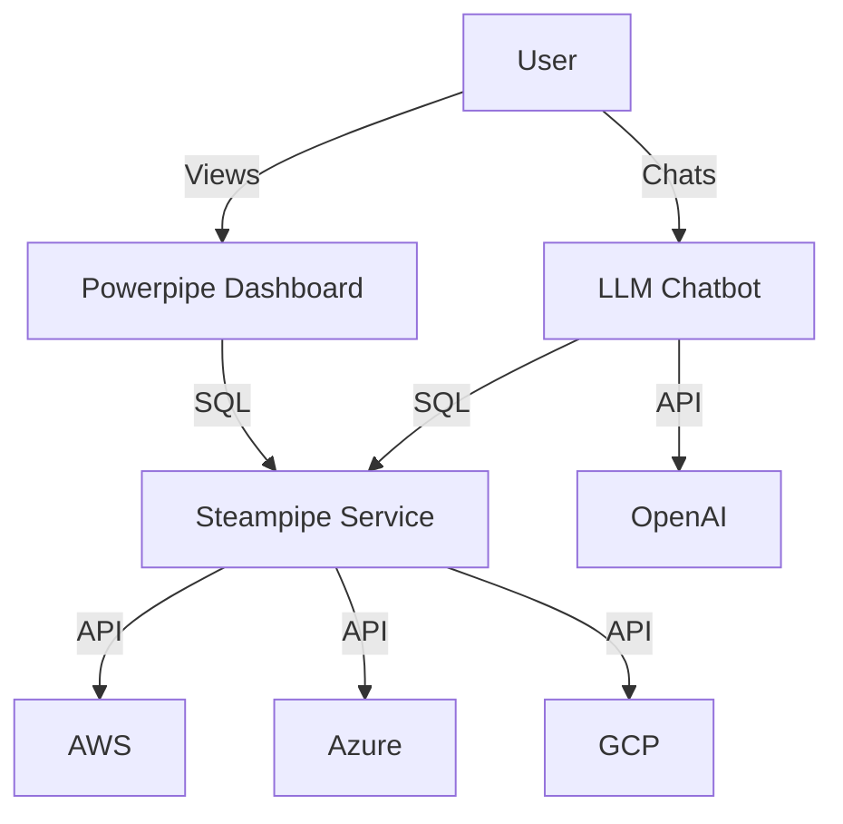

# Cloud Cost Compass

A Multi-Cloud cost analysis and optimization platform powered by **Steampipe** (Data), **Powerpipe** (Visualization), and **LLM** (AI).

## Features
- **Multi-Cloud Support**: Single view for AWS, Azure, and GCP costs.
- **Steampipe Data Layer**: Queries cloud APIs as a standardized SQL database.
- **Powerpipe Dashboards**: Interactive, code-defined dashboards for deep cost analysis.
- **AI Chatbot**: Natural language querying of your infrastructure data using OpenAI and LangChain.
- **Kubernetes Native**: Fully containerized and deployable to any K8s cluster.

## Architecture



## Setup & Installation

### Prerequisites
- Kubernetes Cluster
- Docker
- Credentials for AWS, Azure, GCP
- OpenAI API Key

### 1. Configure Secrets
Edit `infrastructure/k8s/00-secrets.yaml` and insert your actual credentials.
```yaml
apiVersion: v1
kind: Secret
metadata:
  name: cloud-cost-secrets
stringData:
  AWS_ACCESS_KEY_ID: "your-key"
  # ... other credentials
  OPENAI_API_KEY: "sk-..."
```

### 2. Build Images
```bash
# Build Steampipe
docker build -t cloud-cost-compass/steampipe:latest -f steampipe/Dockerfile steampipe/

# Build Powerpipe
docker build -t cloud-cost-compass/powerpipe:latest -f powerpipe/Dockerfile powerpipe/

# Build Chatbot
docker build -t cloud-cost-compass/chatbot:latest -f chatbot/Dockerfile chatbot/
```
*Note: In a real environment, push these to a registry or use `minikube image load`.*

### 3. Deploy to Kubernetes
```bash
kubectl apply -f infrastructure/k8s/
```

## Usage

### Dashboards
Access the Powerpipe dashboard (default port 9033):
- **Overview**: High-level cost summary across clouds.
- **AWS/Azure/GCP Detail**: Service-level breakdown.

### Chatbot
The Chatbot API runs on port 8000.
Example query:
```bash
curl -X POST http://<chatbot-ip>:8000/chat \
     -H "Content-Type: application/json" \
     -d '{"message": "What is my most expensive AWS service this month?"}'
```

## Directory Structure
- `steampipe/`: Steampipe configuration and Dockerfile.
- `powerpipe/`: Powerpipe module, dashboards, and Dockerfile.
- `chatbot/`: Python FastAPI AI application.
- `infrastructure/k8s/`: Kubernetes manifests.