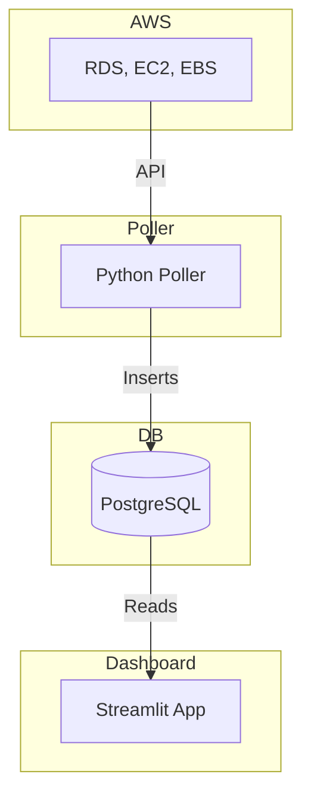

# Cloud Cost Compass

A Streamlit-powered dashboard and AWS poller to help organizations identify and eliminate hidden costs, optimize resource utilization, and gain comprehensive visibility into their cloud infrastructure spending.

---

## Table of Contents
- [Overview](#overview)
- [Features](#features)
- [Architecture](#architecture)
- [Directory Structure](#directory-structure)
- [Setup & Installation](#setup--installation)
- [Database Schema](#database-schema)
- [Configuration](#configuration)
- [Running Locally (Docker)](#running-locally-docker)
- [Kubernetes Deployment](#kubernetes-deployment)
- [Helm Chart Usage](#helm-chart-usage)
- [Contributing](#contributing)
- [License](#license)

---

## Overview
Cloud Cost Compass provides continuous visibility into your AWS RDS, EC2, and EBS resources, storing inventory and configuration data in a PostgreSQL database. It features a Streamlit dashboard for real-time insights and cost optimization opportunities.

## Features
- **Automated AWS Polling**: Collects RDS, EC2, and EBS data from multiple AWS roles every 6 hours.
- **Centralized Storage**: All data is stored in a PostgreSQL database for historical analysis.
- **Interactive Dashboards**: Streamlit app provides filtering, grouping, and visualization for each AWS service.
- **Kubernetes & Helm Ready**: Easily deployable on any K8s cluster with provided manifests and Helm chart.
- **Modular Design**: Clean separation between poller, dashboard, and infrastructure code.

## Architecture



## Directory Structure
```
cloud-cost-compass/
├── code/
│   ├── poller/
│   │   ├── poller.py
│   │   └── Dockerfile
│   └── app/
│       ├── app.py
│       └── Dockerfile
├── manifests/
│   ├── k8s-dashboard.yaml
│   ├── k8s-poller.yaml
│   ├── svc-dashboard.yaml
│   └── svc-poller.yaml
├── helm/
│   └── cloud-cost-compass/
│       ├── Chart.yaml
│       ├── values.yaml
│       └── templates/
│           ├── k8s-dashboard.yaml
│           ├── svc-dashboard.yaml
│           ├── k8s-poller.yaml
│           └── svc-poller.yaml
├── requirements.txt
├── schema.sql
└── README.md
```

## Setup & Installation

### Prerequisites
- Python 3.9+
- Docker
- Kubernetes cluster (minikube, EKS, etc.)
- Helm 3+
- PostgreSQL instance
- AWS credentials with assume-role permissions

### 1. Clone the Repository
```sh
git clone https://github.com/yourorg/cloud-cost-compass.git
cd cloud-cost-compass
```

### 2. Install Python Dependencies
```sh
pip install -r requirements.txt
```

### 3. Set Up the Database
Run the schema SQL on your Postgres instance:
```sh
psql -h <host> -U <user> -d <db> -f schema.sql
```

## Database Schema
See [`schema.sql`](schema.sql) for full details.

- **rds_instances**: Stores RDS DB instance metadata
- **ec2_instances**: Stores EC2 instance metadata
- **ebs_volumes**: Stores EBS volume metadata

## Configuration
All sensitive values (DB connection, AWS roles) are set via environment variables. See the Dockerfiles and manifests for details.

## Running Locally (Docker)

### Build Images
```sh
# Poller
cd code/poller
docker build -t cloud-cost-poller .
# Dashboard
cd ../app
docker build -t cloud-cost-dashboard .
```

### Run Containers
```sh
docker run -e AWS_ROLES=... -e POSTGRES_HOST=... ... cloud-cost-poller
docker run -p 8501:8501 -e POSTGRES_HOST=... ... cloud-cost-dashboard
```

## Kubernetes Deployment

### Apply Manifests
```sh
kubectl apply -f manifests/
```

### Access the Dashboard
- The dashboard will be available at the LoadBalancer IP on port 80.

## Helm Chart Usage

### Install/Upgrade
```sh
cd helm/cloud-cost-compass
helm install cloud-cost-compass .
# or
helm upgrade cloud-cost-compass .
```

### Customization
Edit `values.yaml` to set images, environment variables, and service types as needed.

## Contributing
1. Fork the repo and create your branch (`git checkout -b feature/fooBar`)
2. Commit your changes (`git commit -am 'Add some fooBar'`)
3. Push to the branch (`git push origin feature/fooBar`)
4. Create a new Pull Request

## License
[MIT](LICENSE)